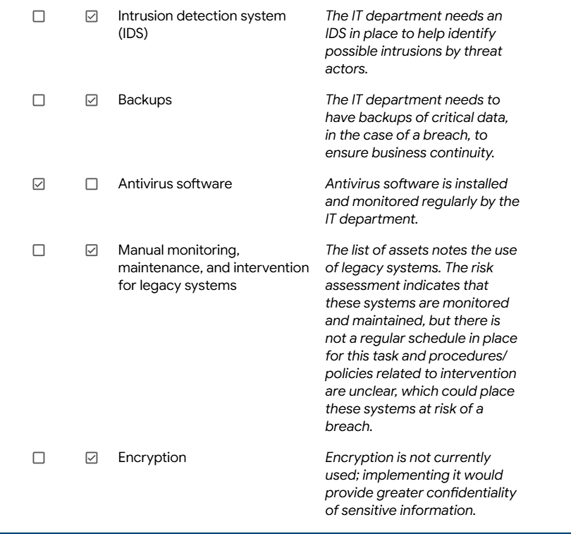
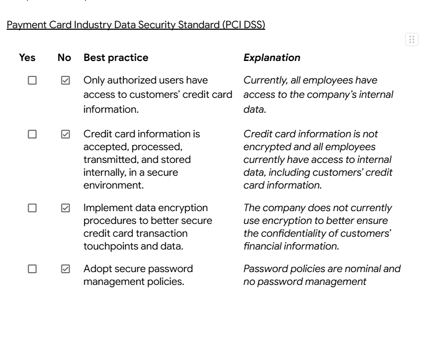
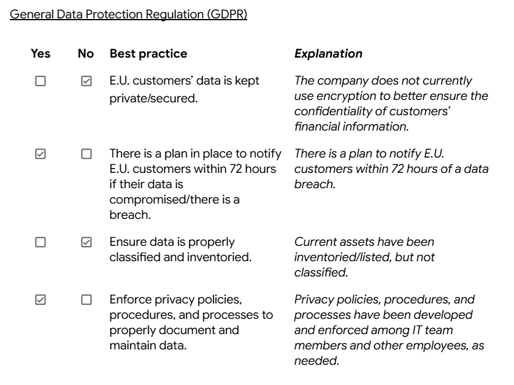
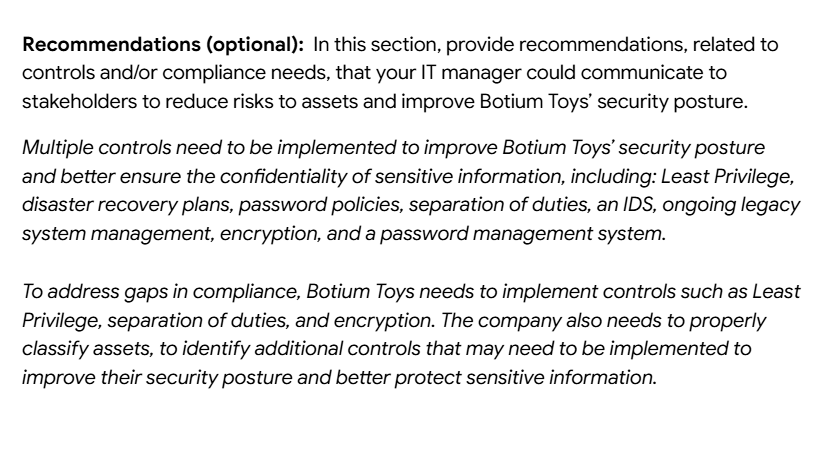

# Internal Security Audit & Compliance Assessment

Framework: NIST Cybersecurity Framework (CSF)

Focus: Cybersecurity Risk & GRC Analysis

## Executive Summary

This project documents an internal security audit conducted for Botium Toys, a growing retail and ecommerce organization expanding operations internationally. The assessment evaluated security controls, compliance posture, and organizational risk exposure using NIST CSF principles.

The audit identified significant control gaps affecting confidentiality, access governance, and business continuity. The organization received an overall High Risk Rating (8/10) due to missing technical controls and incomplete regulatory alignment.

## Audit Objectives

- Evaluate existing security controls

- Assess regulatory compliance exposure

- Identify governance and risk gaps

- Provide risk-based remediation recommendations

## Frameworks & Standards Referenced

- NIST Cybersecurity Framework

- PCI-DSS

- GDPR

- SOC 2 Principles

## Key Risk Themes

- Excessive user access to sensitive data

- Lack of encryption protections

- No disaster recovery capability

- Weak identity and password governance

- Missing intrusion detection monitoring

## Project Deliverables

- Control Effectiveness Assessment

- Compliance Evaluation

- Risk Findings Documentation

- Remediation Roadmap

## Evidence (Screenshots)

### Controls & Compliance Checklist

### PCI-DSS Review

### GDPR Review

### Recommendations Summary

